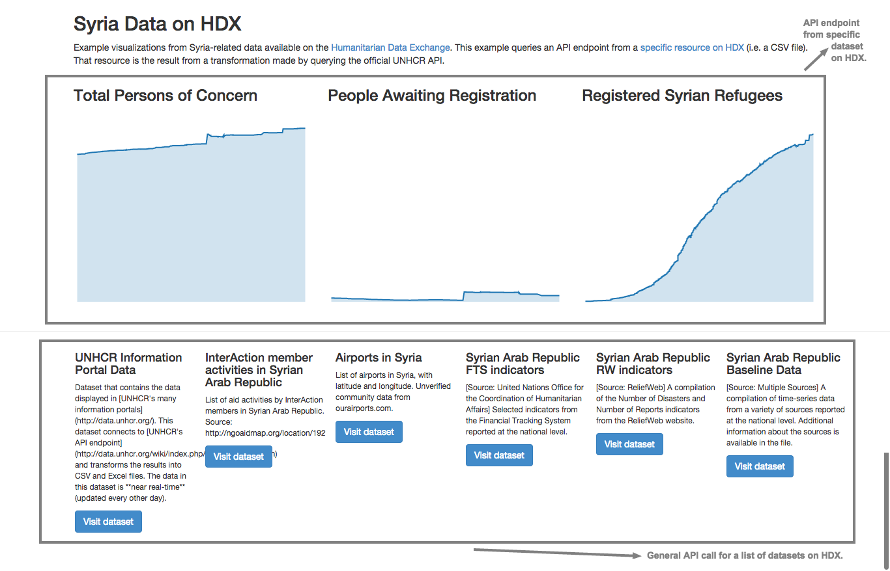

## HDX API Examples

This repository contains simple examples of how to make API calls to HDX, generating visualizations, lists of datsets, among others.

HDX is based on CKAN. It uses two main APIs to serve data:
- The [CKAN API](http://docs.ckan.org/en/latest/api/index.html) (*link to documentation*)
- The [DataStore API](http://docs.ckan.org/en/latest/maintaining/datastore.html#the-datastore-api) (*link to documentation*)

The *CKAN API* is useful to get a list of datasets, metadata about specific datasets, and other operations relevant to understanding the ecosystem of datasets in HDX. For instance, you can get a list of datasets that are from a [specific organization](https://data.hdx.rwlabs.org/api/action/organization_show?id=world-health-organization).

The *DataStore API* allows you to get data from specific resources in HDX. For instance, you can get specific columns from a CSV file and generate a visualization.

**Note:** the DataStore API is only supported for a limited number of datasets on HDX.

This webpage contains examples of visualizations made directly from data of a resouce on HDX. Those visualizations are made using the DataStore API. It also queries the more general CKAN API to get a list of datasets about Syria.

http://luiscape.github.io/hdx-datstore-example/

